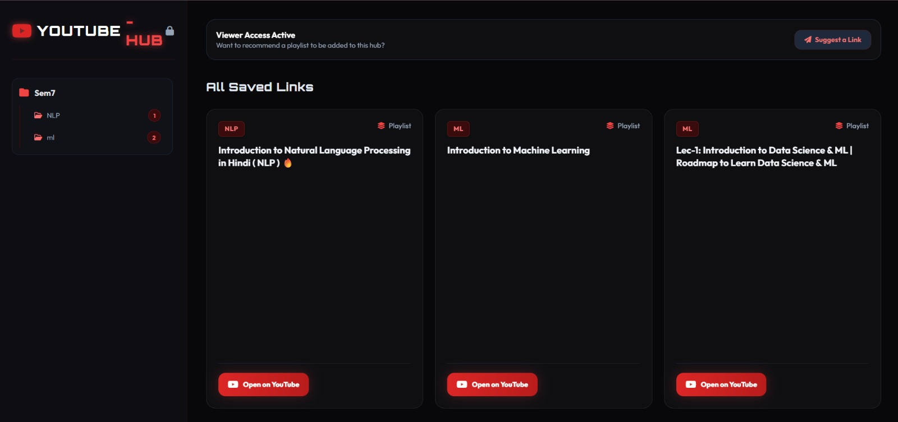
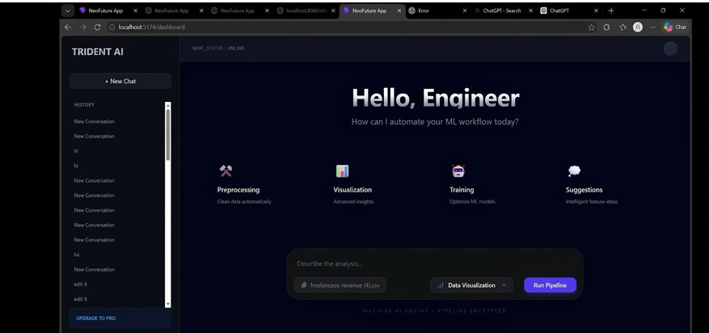
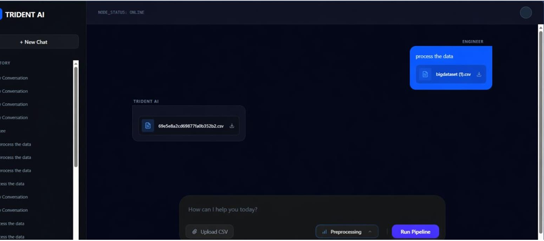

<div align="center">

  

<a href="https://git.io/typing-svg">
  
</a>

<br/>


<br/>


</div>

<br/>

## 👨‍💻 Who I Am

```typescript
const aditya = {
  title: "CS Student",
  stack: ["C++", "Python", "Kotlin", "Java", "HTML/CSS/JS", "Pandas", "Streamlit"],
  launchedProjects: ["YOUTUBE-HUB", "trident-ai", "Ai_xirragent", "Mobile_Computing_Lab"],
  certifications: [], // add yours here
  status: "🚀 Currently building & training ML models",
  openTo: ["Internships", "Full-time roles", "Collaborations"]
};
```

<br/>

## 🚀 Featured Projects

### 📺 YOUTUBE-HUB

> YouTube hub built for students.

<div align="center">
  
 
</div>

<div align="center">
  <a href="https://github.com/adi2105-co/YOUTUBE-HUB">
    
  </a>
</div>

| Layer      | Technology |
|------------|------------|
| Frontend   | HTML       |

<div align="center">

[](https://youtube-hub-fawn.vercel.app/)
[](https://github.com/adi2105-co/YOUTUBE-HUB)

</div>

<br/>

### 🔱 trident-ai

> Builds and trains ML models.

<div align="center">
  
  <br/><br/>
  
</div>

<div align="center">
  <a href="https://github.com/adi2105-co/trident-ai">
    
  </a>
</div>

| Layer      | Technology |
|------------|------------|
| Core       | Python     |
| ML         | Trained Models |

<div align="center">

[](https://trident-ai-wheat.vercel.app/)
[](https://github.com/adi2105-co/trident-ai)

</div>

<br/>

## 🛠️ Tech Stack

**Languages**


**Frontend**


**AI / Data**


<br/>

## 📊 GitHub Stats

<div align="center">


</div>

### 🏆 Trophies

<div align="center">


</div>

### 📈 Contribution Graph

<div align="center">


</div>

<br/>

## 🔗 Connect With Me

<div align="center">

[](https://www.linkedin.com/in/aditya-singh-47915520b/)
[](https://x.com/aditya_singh82)
[](https://www.instagram.com/its_adityasingh21/)
[](https://leetcode.com/u/fdJtgFM2LO/)
[](mailto:adityasingh9970443690@gmail.com)

</div>


